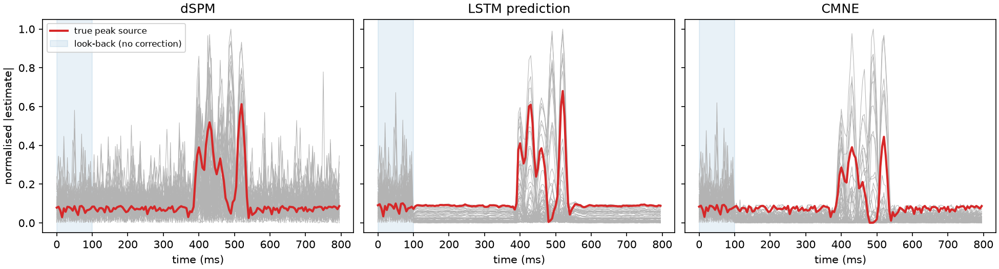

<div align="center">

# CMNE — Contextual Minimum-Norm Estimates

**Turn any linear MEG/EEG inverse solution into a spatiotemporal one with an LSTM that learns the brain's context.**

[](https://github.com/chdinh/cmne/actions/workflows/ci.yml)
[](https://pypi.org/project/cmne/)
[](https://pypi.org/project/cmne/)
[](LICENSE)
[](https://doi.org/10.3389/fnins.2021.552666)
[](https://arxiv.org/abs/1909.02636)



</div>

---

## What is CMNE?

Classical distributed inverse methods such as MNE, dSPM and sLORETA estimate each time sample **independently**. Real neural activity is not independent in time, though. What happens now depends on what happened before.

CMNE uses that temporal context:

1. Compute a standard source estimate $\hat q_t$ (here: dSPM), rectified and z-scored per source.
2. Feed the last $k$ **contextual** estimates $b_{t-k},\dots,b_{t-1}$ to an LSTM network that predicts the next estimate.
3. Use the normalised prediction as a time-varying spatial filter on the current estimate:

$$
b_t = W_t^{\mathrm{CMNE}}\,\hat q_t,\qquad
\operatorname{diag}\!\left(W_t^{\mathrm{CMNE}}\right)=\frac{\left|\mathrm{LSTM}(b_{t-k:t-1})\right|}{\max\left|\mathrm{LSTM}(b_{t-k:t-1})\right|}
$$

Because $b_t$ feeds back into the LSTM, this forms a Markov chain. In the paper this gave **higher source-space SNR, lower spatial dispersion and smaller localisation error** than dSPM, on both simulated epileptiform spikes and recorded auditory steady-state responses.

> Dinh C, Samuelsson JG, Hunold A, Hämäläinen MS, Khan S. **Contextual MEG and EEG Source Estimates Using Spatiotemporal LSTM Networks.** *Front. Neurosci.* 2021;15:552666. [doi:10.3389/fnins.2021.552666](https://doi.org/10.3389/fnins.2021.552666)

## Highlights

- **Runs anywhere.** PyTorch backend on CPU, NVIDIA CUDA or Apple Silicon (MPS), selected automatically. bfloat16 mixed precision on CUDA.
- **Runs on modest hardware.** Training data are generated on the fly from sensor data, so memory scales with the sensor data, not the source space. Model size (`num_units`) is configurable.
- **Fast.** The inverse operator is folded into one matrix, and many trials are processed as one batch (~6× higher throughput per trial at paper scale).
- **Deployable.** Export to **ONNX** and run with **ONNX Runtime**, no PyTorch needed at inference time.
- **Faithful.** Implements Eqs. (9)–(13) and the paper's control estimate and fidelity metrics (Eqs. 22–26), with tests against literal reference implementations.
- **Works with your MNE-Python data.** Accepts `mne.Epochs`, `mne.SourceEstimate` and inverse operators directly.

## Installation

```bash
pip install cmne              # core (PyTorch + MNE-Python)
pip install "cmne[onnx]"      # + ONNX export / ONNX Runtime inference
pip install "cmne[viz]"       # + matplotlib for the examples
```

For a GPU, install the matching [PyTorch build](https://pytorch.org/get-started/locally/) first. CMNE then uses it automatically.

<details>
<summary>Development install</summary>

```bash
git clone https://github.com/chdinh/cmne && cd cmne
python -m venv .venv && source .venv/bin/activate
pip install -e ".[dev]"
pytest
```
</details>

## Quick start

Check your installation in seconds on simulated data (CPU only):

```bash
cmne demo
```

```
dSPM  peak error  46.2 mm   spatial dispersion  58.4 mm
CMNE  peak error   0.0 mm   spatial dispersion  40.0 mm
```

### Python API

```python
import cmne
from mne.minimum_norm import apply_inverse

# epochs: mne.Epochs, inv: mne.minimum_norm.InverseOperator
kernel = cmne.inverse_kernel(epochs.info, inv, lambda2=1 / 9, method="dSPM")

# Train the LSTM on single-trial dSPM estimates (paper: k=80, d=1280)
model = cmne.fit(
    epochs[train], kernel, look_back=80, num_units=1280, n_steps=250, validation=epochs[test]
)
model.save("cmne.pt")

# Apply to an averaged response
stc = apply_inverse(epochs[test].average(), inv, 1 / 9, "dSPM", pick_ori="normal")
result = cmne.apply_cmne(stc, model)
result.cmne.plot(subject="sample", subjects_dir=subjects_dir)  # an mne.SourceEstimate
```

`apply_cmne` returns a `CMNEResult` with the normalised input (`sensing`), the raw LSTM `prediction` and the contextual estimate (`cmne`). These are `SourceEstimate`s when the input was one, NumPy arrays otherwise. Pass an array of shape `(n_signals, n_sources, n_times)` to process many signals in one batch.

### Deploy with ONNX Runtime

```python
cmne.export_onnx(model, "cmne.onnx")
predictor = cmne.OnnxPredictor("cmne.onnx")  # no PyTorch needed
result = cmne.apply_cmne(stc, predictor)
```

### Command line

```bash
cmne train  --raw sub01_raw.fif --inv sub01-inv.fif --events sub01-eve.fif -o cmne.pt
cmne export cmne.pt -o cmne.onnx
cmne apply  --raw sub01_raw.fif --inv sub01-inv.fif --events sub01-eve.fif \
            --model cmne.onnx --n-average 20 -o results/
```

Run `cmne <command> --help` for all options (epoch window, rejection thresholds, MEG-only, look-back, units, …).

## Reproducing the paper

The ASSR data set (MEG + EEG, 1,653 clean epochs, ~4.3 GB) is public on [OSF](https://osf.io/zhqnp/):

```bash
python examples/assr_paper.py --data ~/cmne_data                 # paper settings
python examples/assr_paper.py --data ~/cmne_data --units 256      # laptop-friendly
```

| Setting | Paper | Default here |
|---|---|---|
| Inverse | dSPM, SNR = 3, loose 0.2, normal orientation | same |
| Normalisation | rectify + z-score per source (Eq. 9) | same |
| Look-back $k$ / units $d$ | 80 / 1280 | 80 / 1280 |
| Minibatches | 250 × (30 epochs × 20 windows) | same |
| Split | 85 % / 15 % | fixed test indices shipped with the data |
| Evaluation | average of 20 held-out epochs | same |

## Choosing a model size

Training cost is dominated by the LSTM input projection, $4d \times n_\text{sources}$ weights. Approximate parameter counts for 5,124 sources:

| `num_units` | Parameters | fp32 weights | Suggested hardware |
|---:|---:|---:|---|
| 128 | 3.4 M | 13 MB | any laptop CPU |
| 256 | 6.8 M | 27 MB | laptop CPU / Apple Silicon |
| 640 | 18.0 M | 72 MB | entry-level GPU, M-series Mac |
| 1280 (paper) | 39.4 M | 157 MB | ≥ 6 GB GPU |

To reduce memory further, lower `epochs_per_batch` × `windows_per_epoch` (default 30 × 20 = 600 windows per step).

## Performance

`python benchmarks/bench_inference.py`: paper-scale model (5,124 sources, $k$ = 80, $d$ = 1280), Apple M-series CPU:

| Backend | 1 signal | 20 signals (batched) |
|---|---:|---:|
| PyTorch | 43 ms / step | **7.6 ms / step / signal** |
| ONNX Runtime | 41 ms / step | 18.9 ms / step / signal |

Training draws single-trial estimates on the fly as `kernel @ epochs` (one BLAS call per minibatch). The original code ran `apply_inverse_epochs` per epoch on every iteration.

## What changed vs. the 2017–2022 code

The original implementation (preserved in [`archive/`](archive)) was rewritten as a small, tested library. Bugs fixed along the way:

- **Training/inference mismatch.** The network was trained on signed z-scored dSPM, but applied to *rectified, max-normalised* dSPM. Both now use Eq. (9).
- **Weights did not follow Eq. (11).** The raw prediction (possibly negative, unbounded) multiplied the estimate. Weights are now $|\text{pred}|/\max|\text{pred}|$. The legacy behaviour is available via `normalize_weights=False`.
- **Off-by-one windowing.** One valid window per epoch was dropped (`range(samples - look_back - 1)`).
- **Fragile epoch selection.** `Data.epochs/train_epochs/test_epochs` tested `idx == None`, which raises for NumPy index arrays. Unloaded epochs were counted by iterating all of them several times. Splits are now plain index arrays.
- **Crashes.** `train()` referenced undefined `test_predict`/`test_labels` and returned nothing. `generate_normalized_input` called `self.epochs[idx]` on a method. `Settings` crashed when the results folder did not exist.
- **Non-portable / unsafe I/O.** The data fetcher used `os.system('mv …')`/`rm -r` with string paths. It now uses `pathlib`/`zipfile`.
- **Hard-coded 5,124 sources and `k = 80`** in the evaluation script. Both now come from the model.
- **Divide-by-zero** for constant sources in `standardize`.
- **Dead dependencies.** TensorFlow 2.6 / standalone Keras with the removed `fit_generator` API were replaced by PyTorch. `pandas` was dropped.

## API overview

| Function / class | Purpose |
|---|---|
| `inverse_kernel(info, inv, lambda2, method)` | Inverse operator → `(n_sources, n_channels)` matrix |
| `fit(epochs, kernel, ...)` → `CMNEModel` | Train the LSTM predictor |
| `CMNEModel.save / load / predict` | Persistence and inference |
| `apply_cmne(source, predictor)` → `CMNEResult` | Contextual estimate (Eqs. 10–13) |
| `control_estimate(source, look_back)` | Paper's LSTM-free control |
| `export_onnx`, `OnnxPredictor` | ONNX deployment |
| `peak_localization_error`, `spatial_dispersion`, `source_snr` | Fidelity metrics (Eqs. 22–26) |
| `simulate_data`, `fetch_assr` | Data |

## Citation

If you use CMNE, please cite:

```bibtex
@article{dinh2021cmne,
  title   = {Contextual {MEG} and {EEG} Source Estimates Using Spatiotemporal {LSTM} Networks},
  author  = {Dinh, Christoph and Samuelsson, John G. and Hunold, Alexander and
             H{\"a}m{\"a}l{\"a}inen, Matti S. and Khan, Sheraz},
  journal = {Frontiers in Neuroscience},
  volume  = {15},
  pages   = {552666},
  year    = {2021},
  doi     = {10.3389/fnins.2021.552666}
}
```

## License

[MIT](LICENSE) © 2017–2026 the CMNE authors.
